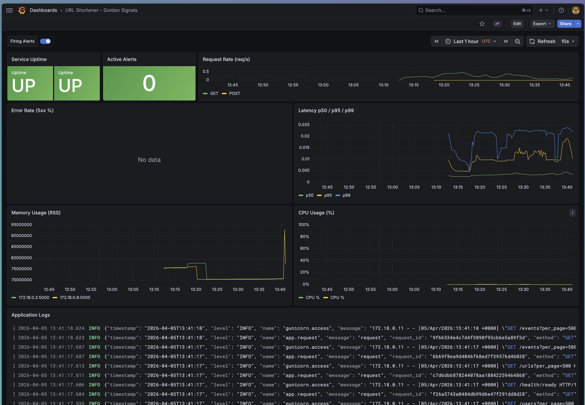
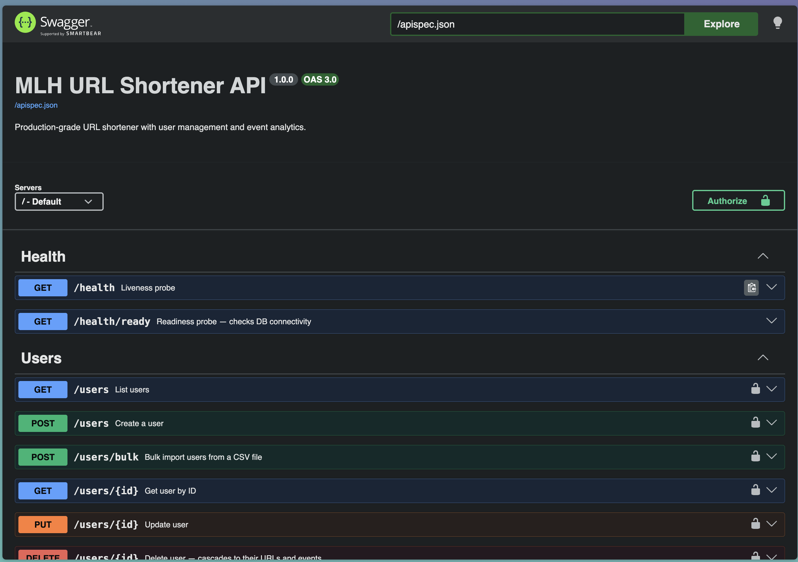
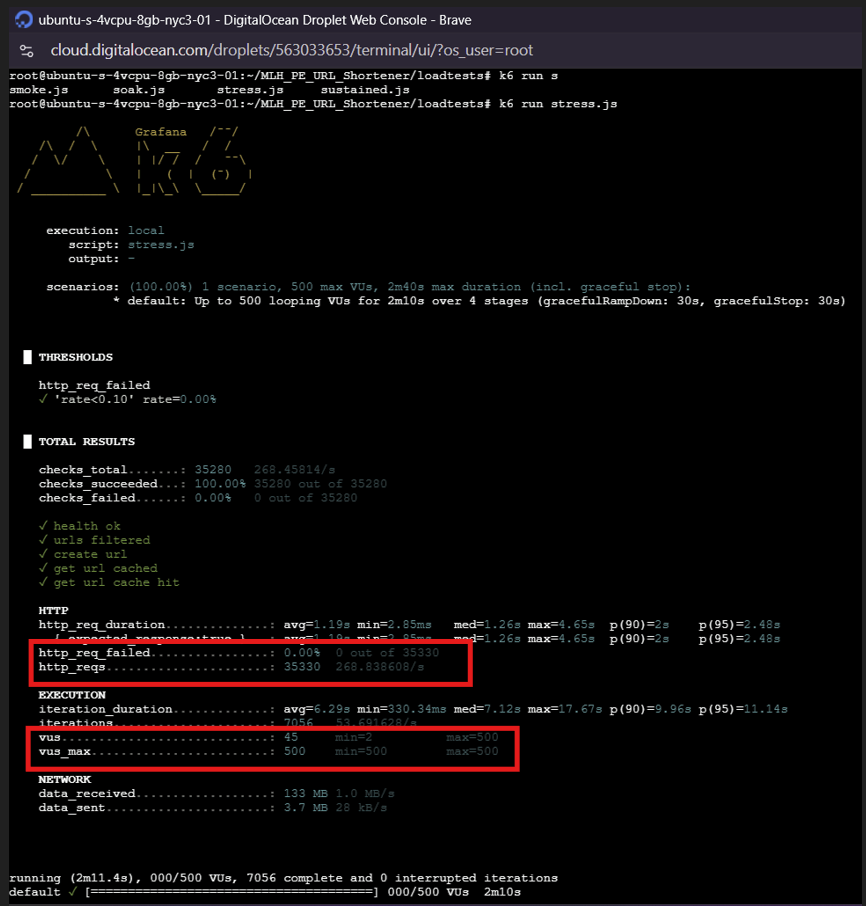
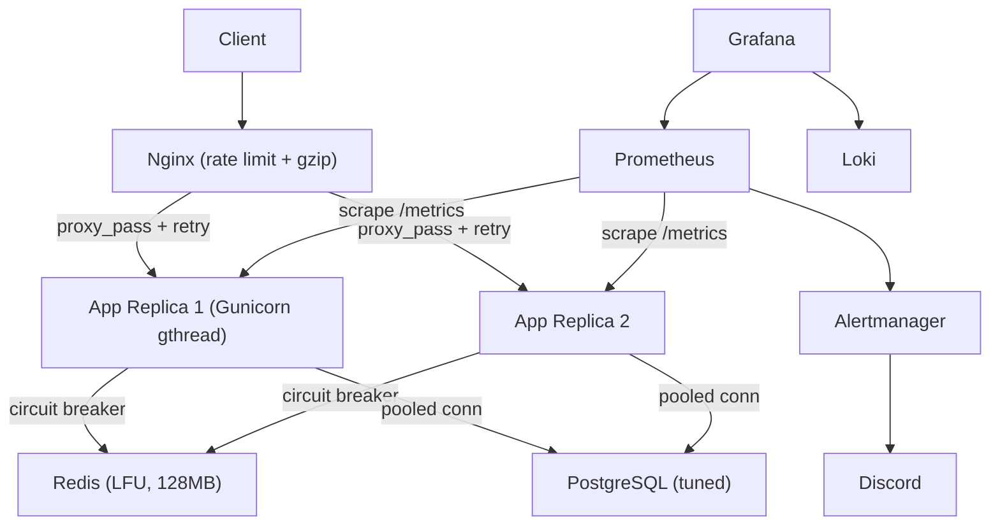
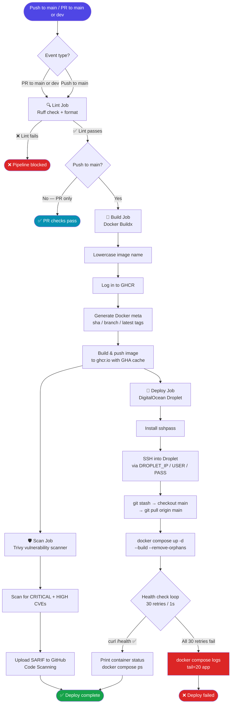

# MLH PE URL Shortener

[](https://github.com/RETR0-OS/MLH_PE_URL_Shortener/actions/workflows/unit-tests.yml)
[](https://github.com/RETR0-OS/MLH_PE_URL_Shortener/actions/workflows/load-tests.yml)
[](docs/Reliability/RELIABILITY_ENGINEERING.md)
[](LICENSE)

A production-grade URL shortener REST API built for the MLH Production Engineering hackathon. It covers all 4 tracks: Reliability, Scalability, Incident Response, and Documentation.

**Who is this for?** Engineers who want a reference implementation of a URL shortener that is built to production standards — with horizontal auto-scaling, a full observability stack, zero-downtime deploys, chaos testing, and 91% test coverage — all running on a single $12/month DigitalOcean droplet.

**Live**: http://64.225.10.147 | **Docs**: http://64.225.10.147/docs/ | **Dashboard**: http://64.225.10.147:3000

## What It Does

Create shortened URLs that redirect users to their targets. The system scales horizontally with auto-scaling replicas, caches hot reads in Redis with a circuit breaker, and logs everything to a full observability stack (Prometheus, Grafana, Loki, Jaeger) with sub-90-second alert latency. Handles 400+ req/s on a single droplet with 99.9% uptime and zero downtime deploys.

## Screenshots

| Grafana — Golden Signals Dashboard | Swagger UI — API Docs |
|---|---|
|  |  |

**k6 Load Test — 500 VUs, 0% error rate**


## Architecture


## CI/CD Pipeline — DigitalOcean Deployment



## Workflows

| File | Trigger | Jobs |
|---|---|---|
| `.github/workflows/ci.yml` | push `main`, PRs to `main`/`dev` | lint → build → scan |
| `.github/workflows/deploy.yml` | push `main` only | SSH deploy to droplet |

> **Note:** Both workflows fire in parallel on push to `main` — the deploy does not wait for the vulnerability scan to complete.

## Quick Start (Local Development)

### Prerequisites
- Python 3.13+
- `uv` package manager: `curl -LsSf https://astral.sh/uv/install.sh | sh`
- PostgreSQL 16 (or use Docker Compose below)
- Docker & Docker Compose (for full stack)

### Option A: Full Stack (Recommended — 2 minutes)

```bash
git clone https://github.com/RETR0-OS/MLH_PE_URL_Shortener.git
cd MLH_PE_URL_Shortener

cp .env.example .env
# Edit .env if you want to customize (usually not needed locally)

docker compose up -d --build

# Wait for services to be healthy (30-60s)
curl http://localhost/health
# → {"status": "ok"}

# Seed sample data
docker compose exec app python scripts/seed.py

# Open dashboards
# - API: http://localhost/docs
# - Grafana: http://localhost:3000 (admin/admin)
# - Prometheus: http://localhost:9090
```

### Option B: Local Python (For Development)

```bash
git clone https://github.com/RETR0-OS/MLH_PE_URL_Shortener.git
cd MLH_PE_URL_Shortener

uv sync

# Create database
createdb hackathon_db

# Run the dev server
uv run flask --app run:app run --port 5000

# In another terminal, seed data (optional)
uv run python scripts/seed.py

# Run tests
uv run pytest --cov=app
```

### First Test

```bash
# Create a user
curl -X POST http://localhost/users \
  -H "Content-Type: application/json" \
  -d '{"username":"alice","email":"alice@example.com"}'

# Create a shortened URL
curl -X POST http://localhost/urls \
  -H "Content-Type: application/json" \
  -d '{
    "user_id": 1,
    "original_url": "https://github.com/RETR0-OS/MLH_PE_URL_Shortener",
    "title": "URL Shortener Repo"
  }'

# Follow the short link (302 redirect)
curl -L http://localhost/urls/abc123/redirect
```

## Production Deployment

See [`docs/DEPLOYMENT.md`](docs/DEPLOYMENT.md) for:
- Deploying to DigitalOcean droplet
- Zero-downtime rolling updates
- Rollback procedures
- Manual rollback (emergency)
- Production monitoring & SLOs

**Automated deploys**: Merge to `main` branch → CI/CD pipeline runs tests → If passing, auto-deploys to production with health check gates.

## API Endpoints

| Method | Path | Description |
|--------|------|-------------|
| GET | `/health` | Liveness probe |
| GET | `/health/ready` | Readiness probe (DB check) |
| GET | `/users` | List users (paginated) |
| POST | `/users` | Create user |
| POST | `/users/bulk` | Bulk import users (CSV) |
| GET | `/users/{id}` | Get user by ID |
| PUT | `/users/{id}` | Update user |
| DELETE | `/users/{id}` | Delete user |
| GET | `/urls` | List URLs (filter by `?user_id=`) |
| POST | `/urls` | Create shortened URL |
| GET | `/urls/{id}` | Get URL by ID |
| PUT | `/urls/{id}` | Update URL |
| DELETE | `/urls/{id}` | Delete URL |
| GET | `/urls/{short_code}/redirect` | Redirect to original URL (302) |
| GET | `/events` | List events |
| GET | `/events/{id}` | Get event by ID |
| POST | `/events` | Create event |
| PUT | `/events/{id}` | Update event |
| GET | `/metrics` | Prometheus metrics |

Full API specification: [docs/openapi.yaml](docs/openapi.yaml)

## Service Ports

| Service | Port |
|---------|------|
| App (Gunicorn) | 5000 |
| Nginx | 80 |
| PostgreSQL | 5432 |
| Redis | 6379 |
| Prometheus | 9090 |
| Alertmanager | 9093 |
| Grafana | 3000 |
| Loki | 3100 |

## Documentation

**Getting Started:**
- [Architecture Overview](docs/ARCHITECTURE.md) — System design, components, data flow
- [Quick Setup Guide](#quick-start-local-development) — Getting running in 2 minutes
- [Configuration & Environment Variables](docs/config.md) — All env vars explained

**Deployment & Operations:**
- [Deployment Guide](docs/DEPLOYMENT.md) — Deploy to production, rollback procedures, monitoring
- [Capacity Planning](docs/CAPACITY_PLAN.md) — Current bottlenecks, scaling scenarios, growth roadmap

**Production:**
- [API Documentation](http://64.225.10.147/docs/) — Interactive Swagger UI
- [Reliability Engineering](docs/Reliability/RELIABILITY_ENGINEERING.md) — 91% test coverage, CI/CD pipeline, chaos testing
- [Scalability Engineering](docs/Scalability/README.md) — Load testing results, architectural decisions, bottleneck analysis
- [Incident Response](docs/Incident Response/runbooks/INCIDENT-PLAYBOOK.md) — On-call runbook, alert response procedures

**Design & Architecture:**
- [Decision Log](docs/DECISION_LOG.md) — All 19 major technical choices: why Flask, PostgreSQL, Redis, Nginx, Gunicorn, Prometheus, Loki, Grafana, Alertmanager, Docker, GitHub Actions, DigitalOcean, uv, k6, and more
- [Incident Response Design Decisions](docs/Incident%20Response/INCIDENT_RESPONSE_ENGINEERING_DESIGN_DECISIONS.md) — Monitoring, alerting, observability choices (detailed evidence map)
- [Root Cause Analysis Template](docs/Incident%20Response/rca/POSTMORTEM-TEMPLATE.md) — Google SRE 5-Whys format for postmortems

## Troubleshooting

**Docker Compose fails to start:**
```bash
# Check logs
docker compose logs

# Common issue: Port already in use
sudo lsof -i :80
# Kill the conflicting process or change port in docker-compose.yml

# Try a full rebuild
docker compose down --volumes
docker compose up -d --build
```

**Health check fails after starting:**
```bash
# Wait 30 seconds and try again (migrations might be running)
sleep 30
curl http://localhost/health/ready

# Check app logs
docker compose logs app | tail -50

# If database connection fails:
docker compose exec postgres psql -U postgres -d hackathon_db -c "SELECT 1;"
```

**Tests failing locally:**
```bash
# Make sure services are running
docker compose up -d

# Clear Python cache
find . -type d -name __pycache__ -exec rm -r {} +

# Run tests with verbose output
uv run pytest -v --tb=short

# Run specific test file
uv run pytest tests/test_urls.py -v
```

**High error rate in production:**
1. Open Grafana: http://64.225.10.147:3000
2. Check "Error Rate" panel
3. Look at "Application Logs" panel for error messages
4. See [`docs/Incident Response/runbooks/INCIDENT-PLAYBOOK.md`](docs/Incident Response/runbooks/INCIDENT-PLAYBOOK.md) for full runbooks

**Latency spike:**
1. Check CPU/memory in Grafana dashboard
2. If CPU > 75%, autoscaler should scale up (check `docker compose ps`)
3. If autoscaler is scaling but latency stays high, see capacity planning docs

See [`docs/DEPLOYMENT.md`](docs/DEPLOYMENT.md#troubleshooting-common-issues) for more troubleshooting.

---

## Data Model

```
users
  id          SERIAL PK
  username    TEXT UNIQUE
  email       TEXT UNIQUE
  created_at  TIMESTAMP

urls
  id          SERIAL PK
  user_id     FK → users.id
  short_code  TEXT UNIQUE   ← random 6-char alphanumeric, indexed
  original_url TEXT
  title       TEXT
  is_active   BOOLEAN
  created_at  TIMESTAMP
  updated_at  TIMESTAMP

events
  id          SERIAL PK
  url_id      FK → urls.id (nullable)
  user_id     FK → users.id (nullable)
  event_type  TEXT          ← 'redirect', 'created', 'updated'
  timestamp   TIMESTAMP
  details     JSONB
```

9 indexes cover all hot read paths. Events are written asynchronously via `ThreadPoolExecutor` (fire-and-forget) so they never block the response path.

---

## Contributing

1. Fork the repository and create a branch from `main`: `git checkout -b feat/your-feature`
2. Run the full test suite before pushing: `uv run pytest --cov=app --cov-fail-under=70`
3. Open a PR against `dev` (not `main`). CI runs 177 unit/integration tests, a 500-VU k6 load test, and ruff lint automatically.
4. All 3 CI checks must be green before merging. The PR template has a checklist — fill it out honestly.
5. `main` is the production branch. Merging to `main` triggers an automatic deploy to the DigitalOcean droplet.

**Dev environment setup**: Follow [Option A (Docker Compose)](#option-a-full-stack-recommended--2-minutes) in Quick Start — it takes 2 minutes and gives you the full stack including Grafana dashboards.

---

## Tech Stack

- **Runtime**: Python 3.13, Flask, Gunicorn (gthread)
- **Database**: PostgreSQL 16 (tuned), Peewee ORM (pooled connections)
- **Cache**: Redis 7 (LFU eviction, circuit-breaker fallback)
- **Proxy**: Nginx (rate limiting, gzip, keepalive, proxy retries)
- **Observability**: Prometheus, Alertmanager, Grafana, Loki, Jaeger
- **CI/CD**: GitHub Actions (pytest + coverage gate + load tests)
- **Orchestration**: Docker Compose (auto-scaling, rolling deploys, health checks)
- **Testing**: pytest (91% coverage), k6 (load testing)
- **Package manager**: uv (Python 3.13, fast lockfile-based installs)
