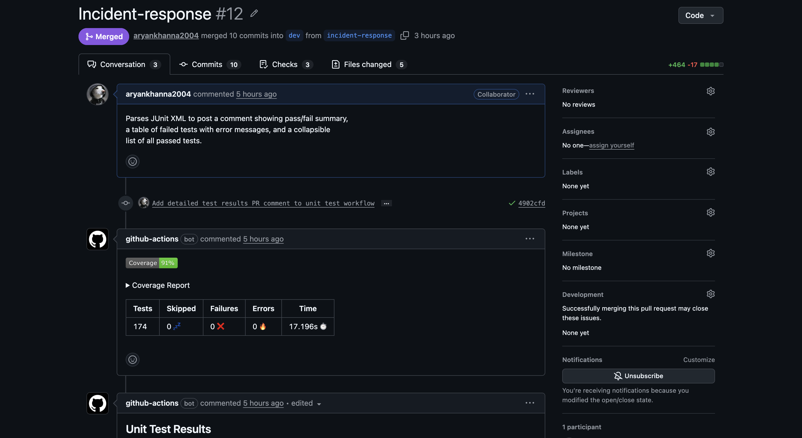
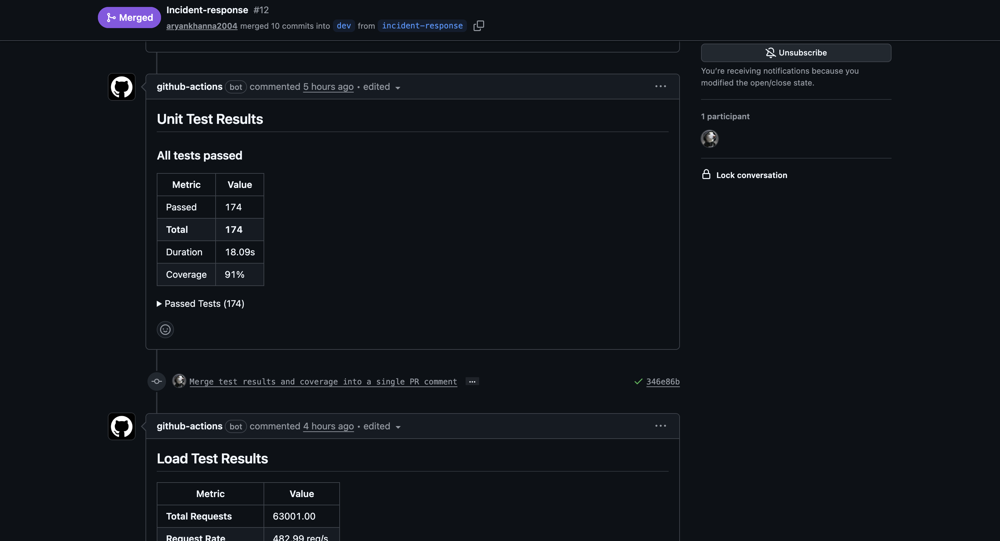
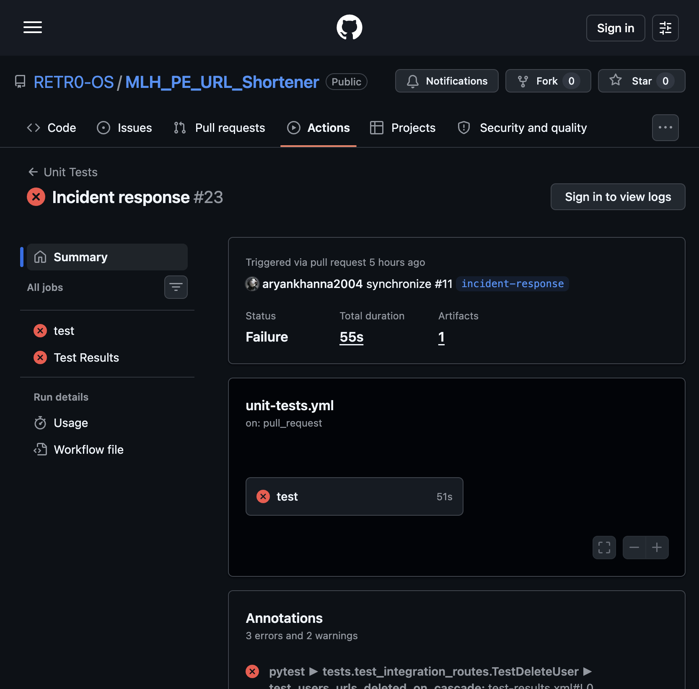
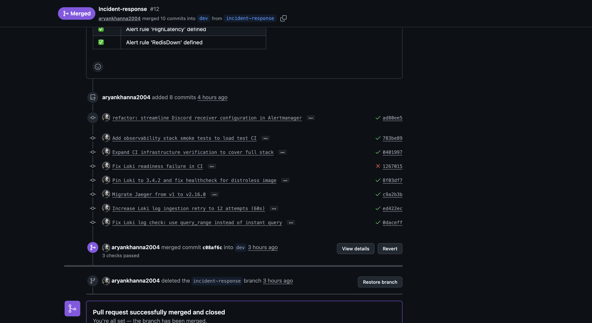
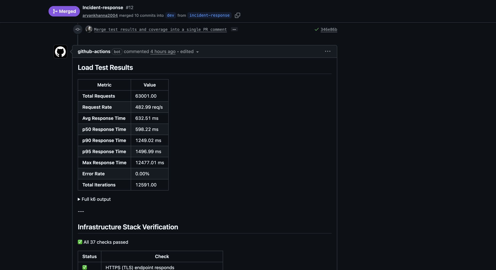
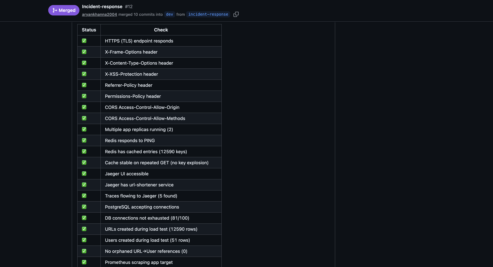
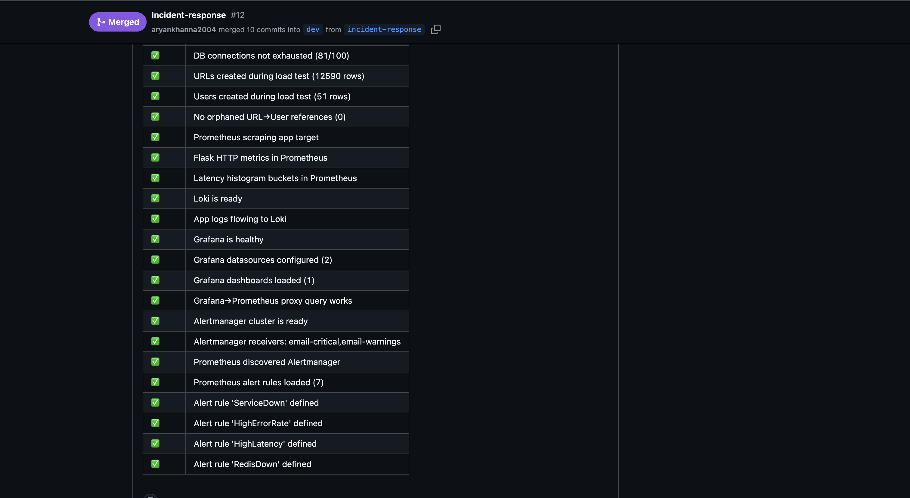

# Reliability Engineering

We built a URL shortener that doesn't just pass tests — it survives production conditions. The service runs as 2 replicated containers behind Nginx, enforces 70%+ test coverage on every PR, self-heals from container crashes and Redis failures without human intervention, and has a full observability stack (Prometheus, Grafana, Loki, Alertmanager) that fires alerts within 90 seconds of a failure. 174 tests across unit, integration, performance, and coverage-gap categories run in CI before any merge is allowed.

---

## 🥉 Bronze — The Shield

### Health Endpoint

`GET /health` returns `200 {"status": "ok"}` at all times as a liveness probe.

`GET /health/ready` executes a live `SELECT 1` against PostgreSQL. Returns `200 {"status": "ok"}` when the DB is reachable, `503 {"status": "unavailable"}` when it is not — tested explicitly in [`tests/test_coverage_gaps.py::TestHealthReadyFailure`](https://github.com/RETR0-OS/MLH_PE_URL_Shortener/blob/dev/tests/test_coverage_gaps.py).

```bash
curl http://localhost/health
# → {"status": "ok"}

curl http://localhost/health/ready
# → {"status": "ok"}
```

### Unit Tests

Tests live in `tests/` and are run with pytest. Unit tests cover pure functions with no I/O:

| File | What it tests |
|---|---|
| [`test_health.py`](https://github.com/RETR0-OS/MLH_PE_URL_Shortener/blob/dev/tests/test_health.py) | `/health` and `/health/ready` responses |
| [`test_unit.py`](https://github.com/RETR0-OS/MLH_PE_URL_Shortener/blob/dev/tests/test_unit.py) | `generate_short_code()` — length, charset, uniqueness; all 4 validators — missing fields, wrong types, invalid email |
| [`test_unit_modules.py`](https://github.com/RETR0-OS/MLH_PE_URL_Shortener/blob/dev/tests/test_unit_modules.py) | API key auth (missing/wrong/correct key, exempt paths); middleware `X-Request-ID` propagation |
| [`test_coverage_gaps.py`](https://github.com/RETR0-OS/MLH_PE_URL_Shortener/blob/dev/tests/test_coverage_gaps.py) | 503 on DB failure, 405 method-not-allowed, 500 internal error — all return clean JSON |

### CI Runs Tests on Every PR

The [`unit-tests.yml`](https://github.com/RETR0-OS/MLH_PE_URL_Shortener/blob/dev/.github/workflows/unit-tests.yml) GitHub Actions workflow runs on every PR to `dev` or `main`. It spins up real Postgres and Redis service containers, runs the full test suite, and posts results directly on the PR.

**PR #12 — bot posts coverage report (91%) and test summary (174 passed, 0 failed):**





> [PR #12 on GitHub](https://github.com/RETR0-OS/MLH_PE_URL_Shortener/pull/12) · [Unit Tests workflow](https://github.com/RETR0-OS/MLH_PE_URL_Shortener/actions/workflows/unit-tests.yml)

---

## 🥈 Silver — The Fortress

### Coverage ≥ 50% (Actual: 91%)

The CI pipeline enforces a hard minimum with `--cov-fail-under=70`. The actual coverage on the latest branch is **91%**, well above both the Silver (50%) and Gold (70%) thresholds.

```
uv run pytest --cov=app --cov-report=term-missing --cov-fail-under=70
```

If coverage drops below 70%, pytest exits with code 1 and the PR cannot be merged.

### Integration Tests

Integration tests hit real API endpoints against a live PostgreSQL database. Every test runs against a freshly truncated database via [`conftest.py`](https://github.com/RETR0-OS/MLH_PE_URL_Shortener/blob/dev/tests/conftest.py):

| File | What it tests |
|---|---|
| [`test_urls.py`](https://github.com/RETR0-OS/MLH_PE_URL_Shortener/blob/dev/tests/test_urls.py) | `POST /urls` → DB write → `GET /urls/{id}` → `PUT` → `DELETE`; short code uniqueness; event auto-created on URL creation |
| [`test_users.py`](https://github.com/RETR0-OS/MLH_PE_URL_Shortener/blob/dev/tests/test_users.py) | Full user CRUD; pagination; bulk CSV import via `POST /users/bulk` |
| [`test_events.py`](https://github.com/RETR0-OS/MLH_PE_URL_Shortener/blob/dev/tests/test_events.py) | Event created on URL creation; response field shapes match OpenAPI spec |
| [`test_integration_routes.py`](https://github.com/RETR0-OS/MLH_PE_URL_Shortener/blob/dev/tests/test_integration_routes.py) | Redirect flow (302/410/404); delete cascades; cursor pagination; v1 prefix routes; full event CRUD |

### The Gatekeeper — CI Blocks Failed Merges

All 3 checks must be green before a PR can merge:

1. **Unit Tests** — `--cov-fail-under=70` blocks on coverage regression or any test failure
2. **Load Tests** — full stack must be healthy and pass 37 infrastructure checks
3. **[CI/CD](https://github.com/RETR0-OS/MLH_PE_URL_Shortener/blob/dev/.github/workflows/ci.yml)** — ruff lint must pass

**A real failed run on PR #11** — a flaky cascade-delete test caused the unit test job to fail on a mid-development push, blocking the merge until fixed:



> The run shows `Status: Failure` with annotation `pytest ► tests.test_integration_routes.TestDeleteUser ► test_users_urls_deleted_on_cascade`. The developer added a timing fix in commit `02fc8f1` and the subsequent run passed, unblocking the merge.

PR #12 merged with all 3 checks passing:



### Error Handling Documentation

Every error returns a JSON object — Python stack traces never reach the client.

| Scenario | Status | Response |
|---|---|---|
| Resource not found | `404` | `{"error": "URL not found"}` |
| Short code not found | `404` | `{"error": "Not found"}` |
| Deactivated URL redirect | `410` | `{"error": "URL is deactivated"}` |
| Method not allowed | `405` | `{"error": "Method not allowed"}` |
| Missing/bad JSON body | `400` | `{"error": "JSON body required"}` |
| Validation failure | `400` | `{"field": "error message"}` per field |
| Duplicate username or email | `409` | `{"error": "..."}` |
| Unauthorized (API key) | `401` | `{"error": "Unauthorized"}` |
| DB unreachable | `503` | `{"status": "unavailable"}` |
| Unhandled exception | `500` | `{"error": "Internal server error"}` |

---

## 🥇 Gold — The Immortal

### Coverage ≥ 70% (Actual: 91%)

Already shown above. The 9 test files collectively cover 91% of application code lines.

### Graceful Failure — Bad Input Returns Clean JSON

Sending garbage to the API returns structured errors, not crashes. These are all covered by integration tests:

```bash
# Missing required field
curl -X POST /urls -d '{}' -H 'Content-Type: application/json'
# → 400 {"user_id": "required", "original_url": "required", "title": "required"}

# Non-integer ID
curl -X POST /events -d '{"url_id": "abc", ...}'
# → 400 {"url_id": "must be an integer"}

# Deactivated URL
curl /urls/abc123/redirect
# → 410 {"error": "URL is deactivated"}

# DB down
curl /health/ready
# → 503 {"status": "unavailable"}
```

### Chaos Mode — Container Kill and Auto-Restart

Docker Compose is configured for automatic recovery with no human intervention:

```yaml
# docker-compose.yml → https://github.com/RETR0-OS/MLH_PE_URL_Shortener/blob/dev/docker-compose.yml
restart: unless-stopped
stop_grace_period: 30s
deploy:
  replicas: 2
  restart_policy:
    condition: on-failure
    max_attempts: 5
    delay: 5s
  update_config:
    order: start-first   # new replica healthy before old one stops
```

**What this means:**
- `restart: unless-stopped` — Docker restarts the container automatically on any crash, OOM kill, or process exit
- 2 replicas — one dying does not take the service down; Nginx routes around it
- `stop_grace_period: 30s` — in-flight requests complete before a planned stop kills the process
- `depends_on: condition: service_healthy` — the app never starts until Postgres and Redis pass their health checks, preventing crash-loops on startup

**Chaos test script** at [`incident-response/chaos/chaos-test.sh`](https://github.com/RETR0-OS/MLH_PE_URL_Shortener/blob/dev/incident-response/chaos/chaos-test.sh) automates the kill-and-verify loop:

```bash
# Kill all app replicas, wait for ServiceDown alert to fire, restart, verify recovery
bash incident-response/chaos/chaos-test.sh --service-down

# Kill Redis, verify circuit breaker kicks in (zero 5xx), wait for RedisDown alert, restore
bash incident-response/chaos/chaos-test.sh --redis-down
```

Each scenario: stops the service → polls Alertmanager API until the alert fires (~70–90 s) → restarts the service → polls `/health/ready` until `200` returns. The script exits non-zero if any step times out.

The [`load-tests.yml`](https://github.com/RETR0-OS/MLH_PE_URL_Shortener/blob/dev/.github/workflows/load-tests.yml) CI workflow also acts as automated chaos verification on every PR — it runs 500 VUs against the stack and confirms `REPLICA_COUNT >= 2`, Redis caching is active, and all 37 infrastructure checks pass:







### Failure Modes Documentation

| Failure | Detection | Recovery |
|---|---|---|
| App container crashes | Docker restart policy | Restarted within 5 s; second replica absorbs traffic |
| App OOM killed (> 384 MB limit) | Docker restart; `HighMemoryUsage` alert | Same restart flow |
| PostgreSQL unavailable | `/health/ready` → 503 | `restart: unless-stopped`; app reconnects via connection pool |
| Redis unavailable | Circuit breaker (< 1 s detection); `RedisDown` alert fires in ~75 s | `restart: unless-stopped`; reads fall through to Postgres; zero 5xx errors; cache refills on recovery |
| Bad input from client | Validation layer returns 400/409/410 before any DB write | No state change; structured JSON error |
| Duplicate record insert | DB unique constraint → `IntegrityError` caught → 409 | No crash, no data corruption |
| N+1 query regression | [`test_performance.py`](https://github.com/RETR0-OS/MLH_PE_URL_Shortener/blob/dev/tests/test_performance.py) catches it in CI pre-merge | PR blocked until fix |
| One replica dies under load | Nginx upstream health check detects it | Docker restarts replica; Nginx adds it back once healthy |
| Broken code in PR | `--cov-fail-under=70` + failing tests = failed check | Merge blocked; fix required |
| Deploy fails health check | `deploy.yml` polls `/health` for 30 s; exits non-zero on timeout | Workflow fails, old containers keep running, team notified via GitHub Actions |

### Continuous Deployment — Auto-Deploy on Merge to Main

Every merge to `main` triggers the [`deploy.yml`](https://github.com/RETR0-OS/MLH_PE_URL_Shortener/blob/dev/.github/workflows/deploy.yml) GitHub Actions workflow, which SSHs into the production DigitalOcean droplet and runs a full rebuild:

1. **Pull latest** — `git pull origin main` on the droplet
2. **Rebuild containers** — `docker compose up -d --build --remove-orphans` rebuilds only changed images
3. **Health gate** — the workflow polls `GET /health` for up to 30 seconds; if the app doesn't come healthy, it dumps container logs and **fails the workflow**
4. **Concurrency lock** — only one deploy runs at a time (`concurrency: deploy-production`), preventing race conditions from back-to-back merges

The deploy pipeline uses GitHub Secrets for credentials (`DROPLET_IP`, `DROPLET_USER`, `DROPLET_PASS`) — no secrets are stored in the repository.

Combined with Docker's `start-first` update policy, this gives us **zero-downtime continuous deployment**: new replicas are healthy and serving before old ones stop, and the CI gate ensures broken code never reaches `main` in the first place.

---

## 🚀 Beyond the Rubric

The rubric asked for a health endpoint, some tests, and a restart policy. We treated those as the floor, not the ceiling.

| What | One line |
|---|---|
| **k6 in CI on every PR** | [`load-tests.yml`](https://github.com/RETR0-OS/MLH_PE_URL_Shortener/blob/dev/.github/workflows/load-tests.yml) fires 500 VUs at the full stack before any merge; results posted as a bot comment |
| **Automated chaos script** | [`chaos-test.sh`](https://github.com/RETR0-OS/MLH_PE_URL_Shortener/blob/dev/incident-response/chaos/chaos-test.sh) runs inject → alert → restore → verify with no manual steps; exits non-zero if anything times out |
| **Nginx load-balancing across 2 live replicas** | One container dying drops zero requests — Nginx routes around it while Docker restarts the failed one |
| **Redis circuit breaker** | Redis failure falls through to direct Postgres reads with zero 5xx errors, verified by the chaos script |
| **91% coverage — 21 pts above Gold** | Dedicated gap tests cover the error handler branches (503, 405, 500) that happy-path tests miss |
| **N+1 query detection as a CI gate** | [`test_performance.py`](https://github.com/RETR0-OS/MLH_PE_URL_Shortener/blob/dev/tests/test_performance.py) counts SELECT statements per endpoint; lazy-loading bugs fail the PR before they ship |
| **`start-first` rolling deploys** | New replica is healthy and serving before the old one stops; zero-downtime by default |
| **CD pipeline — auto-deploy on merge** | [`deploy.yml`](https://github.com/RETR0-OS/MLH_PE_URL_Shortener/blob/dev/.github/workflows/deploy.yml) SSHs into the DigitalOcean droplet, rebuilds containers, and health-checks the app — no manual deploy steps |
| **Alertmanager → Discord + email** | Two independent channels; alert latency under 90 s from failure to notification |
| **OpenTelemetry + Jaeger tracing** | Trace ID flows Nginx → app → DB on every request; slow spans visible in Jaeger without guessing |
| **Loki + Promtail log aggregation** | Logs queryable in Grafana by level, endpoint, or trace ID — no SSH required |
| **Trivy CVE scanning on every image build** | Docker image scanned for known vulnerabilities before being pushed to GHCR |

### Continuous Deployment

The full CI/CD pipeline works as follows:

1. **PR opened → `dev`** — unit tests (174, 91% coverage), load tests (500 VU k6), and ruff lint all run automatically; merge is blocked until all 3 pass
2. **Merge to `main`** — [`deploy.yml`](https://github.com/RETR0-OS/MLH_PE_URL_Shortener/blob/dev/.github/workflows/deploy.yml) triggers, SSHs into the production DigitalOcean droplet, pulls the latest code, rebuilds Docker images, and polls `/health` until the app is confirmed healthy
3. **Health gate** — if the app doesn't pass its health check within 30 seconds, the workflow fails and the old containers keep running
4. **Concurrency lock** — only one deploy runs at a time, preventing race conditions from rapid merges

Due to budget constraints, we run a single DigitalOcean droplet for production — there is no separate dev or staging VM. To compensate, the CI pipeline acts as our staging gate: every PR must pass the full test suite, load tests, and lint checks against a real Postgres + Redis stack inside GitHub Actions before code ever reaches the production server. This means broken code is caught before it touches the droplet, not after.
